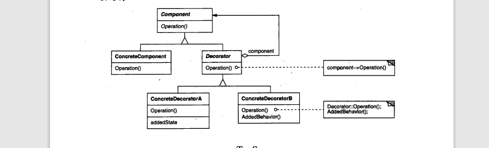

# Decorator 装饰者

    动态的给对象添加一些额外的职责;
装饰者模式遵循 关闭-开发原则，关闭修改，开放扩展；动态的将责任附加在对象上

## 动机(使用场景)

1. 当我们需要给某个对象增加一些功能时，如果使用继承方式不够灵活，而且是静态的；例如A用户需要想在某个对象加入x\y\z三个功能，如果使用继承写死，出现b要想在对象上加入y\z功能时再使用继承重复y\z就会出现短板，
2. 有什么方法能通过去通过组合的方式来实现效果？ 装饰者模式就是在不改变对象的基础上去做扩展，在运行时加入责任

## 效果

在不影响对象的情况下，透明的动态的给对象添加职责

## 结构

- component 要添加职责的对象接口(为装饰者和对象共同父类)
- concreteComponent 要添加指責對象
- decorator 裝飾者
- concreteDecorator 要添加的職責

## 實現
