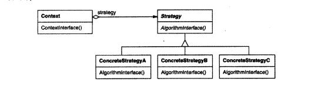

# Strategy 策略模式

    定义多个同类型的算法，封装起来可供替换

## 动机点 

   1. 以作文换行举例，换行有多种形式，空一格换行、固定格子换行、某种规范换行;将这些所有的换行算法塞进一个类中是不可取的
   2. 不同的情况需要的不同算法，最好不要同时支持多种情况
   3. 增加的新的换行算法，需要改变现有算法

我们可以将算法公共点抽离出来做成接口(Strategy)做成不同的实现点(ConcreteStrategy)， 供使用类(context)选择

## 适用点
    
1. 多个类只是行为算法方面不同;
2. 一个类定义了多种行为，多种行为以条件语句的形式出现

